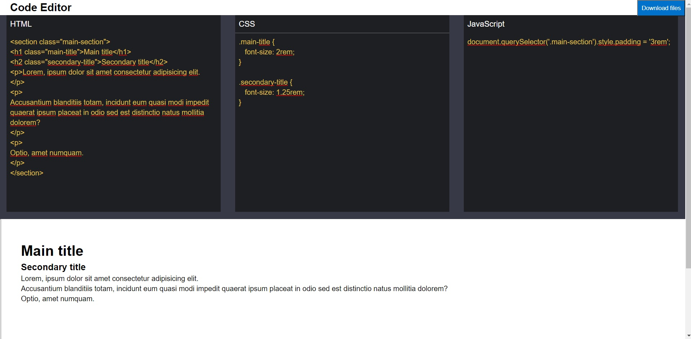

# CodeEditor

CodeEditor is an online text editor implemented with React and styled-components. You can edit HTML, CSS and JavaScript code, with real time rendering. Download the entire project in a zip file, so you can import into your favorite text editor.

## Installation

With [Node](https://nodejs.org/)
installed run: \
    `npm install`

## Local server

Runs the app in the development mode.
Open [http://localhost:3000](http://localhost:3000) to view it in the browser.

## Final result

